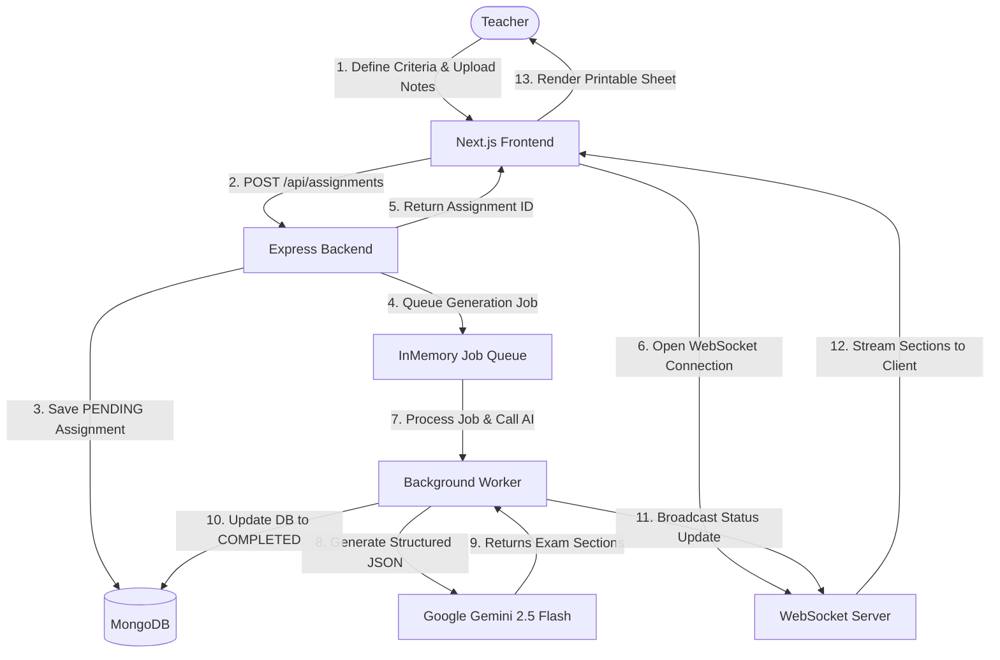

# VedaAI Assessment Creator

VedaAI is a full-stack platform designed to help educators create, customize, and generate structured assessment papers using AI. Built with Next.js, Express, MongoDB, and the Google Gemini API, it features a real-time progress queue using WebSockets to ensure teachers aren't left waiting on blank screens during complex question generation.

The user interface is designed to translate Figma layouts into a highly responsive web application, featuring interactive dashboards, assignment tracking, curriculum guidelines upload, and print-optimized PDF generation.

---

## Architecture & System Flow

Generating high-quality exam papers requires processing time from generative models. To prevent HTTP connection timeouts and provide a responsive user experience, the system uses an asynchronous job processor.



### Key Technical Implementations:
1. **Asynchronous Job Queue**: Instead of generating papers synchronously (which blocks the request/response cycle), requests are placed in an in-memory execution queue.
2. **WebSocket Status Updates**: The frontend establishes a lightweight WebSocket channel that receives status updates (`PENDING` -> `GENERATING` -> `COMPLETED`/`FAILED`) and streams the finished paper payload as soon as it's generated.
3. **Structured Schema Output**: Gemini is instructed using strict JSON schemas to return a structured list of sections, instructions, and questions (each with difficulty tags and marks). This prevents formatting hallucinations.
4. **Print-Optimized Styles**: The generated paper page includes custom `@media print` rules. When printing or exporting to PDF, all web-specific UI elements (buttons, sidebar navigation, headers, and difficulty tags) are hidden, leaving a clean, standard institutional paper layout.

---

## Project Structure

```
├── backend/            # Express, WebSocket & AI service code
│   ├── src/
│   │   ├── config/     # DB connections
│   │   ├── models/     # Mongoose schemas
│   │   ├── services/   # AI prompt builder & Job Queue
│   │   └── server.ts   # Express routes & WS server
│   └── package.json
│
└── frontend/           # Next.js 16 (App Router) client code
    ├── src/
    │   ├── app/        # Dashboard, settings, history, and paper viewer
    │   ├── components/ # Header, Sidebar navigation
    │   └── store/      # Zustand state management
    └── package.json
```

---

## Local Development Setup

Follow these steps to run both the frontend and backend servers locally on your machine.

### 1. Clone & Install Dependencies
First, clone the repository and install all node packages:
```bash
git clone https://github.com/manan7627/Assignment---Full-Stack-Ai-Project.git
cd Assignment---Full-Stack-Ai-Project
npm run install:all
```

### 2. Configure Environment Variables

#### Backend Configuration
Create a `.env` file in the `backend/` directory:
```env
PORT=5000
MONGODB_URI=mongodb://127.0.0.1:27017/veda-assessment
GEMINI_API_KEY=your_google_gemini_api_key
CORS_ORIGIN=http://localhost:3000
```

#### Frontend Configuration
Create a `.env.local` file in the `frontend/` directory:
```env
NEXT_PUBLIC_API_URL=http://localhost:5000
NEXT_PUBLIC_WS_URL=ws://localhost:5000
```

### 3. Run the Development Servers
In separate terminals, start the backend and frontend servers:

* **Start Backend**:
  ```bash
  npm run dev:backend
  ```
* **Start Frontend**:
  ```bash
  npm run dev:frontend
  ```

Open [http://localhost:3000](http://localhost:3000) to view the application.

---

## Deployment Configuration

### Backend (Render / Railway)
1. Link your GitHub repository.
2. Set the **Root Directory** to `backend`.
3. Build Command: `npm install && npm run build`
4. Start Command: `npm start`
5. Configure your production environment variables:
   * `MONGODB_URI`: Your MongoDB Atlas URI. *(Note: If your password has special characters like `@`, replace them with URL-encoded versions like `%40`)*.
   * `GEMINI_API_KEY`: Your Google AI Studio API key.
   * `CORS_ORIGIN`: Your deployed Vercel URL.

### Frontend (Vercel)
1. Import the repository in Vercel.
2. Edit **Project Settings** and set the **Root Directory** to `frontend`.
3. Leave the framework preset as **Next.js**.
4. Configure environment variables:
   * `NEXT_PUBLIC_API_URL`: Your deployed backend Render URL (e.g. `https://your-backend.onrender.com`).
   * `NEXT_PUBLIC_WS_URL`: Your deployed backend WebSocket URL. *(Must use `wss://` instead of `ws://` in production to support SSL)*.
5. Click **Deploy**.
