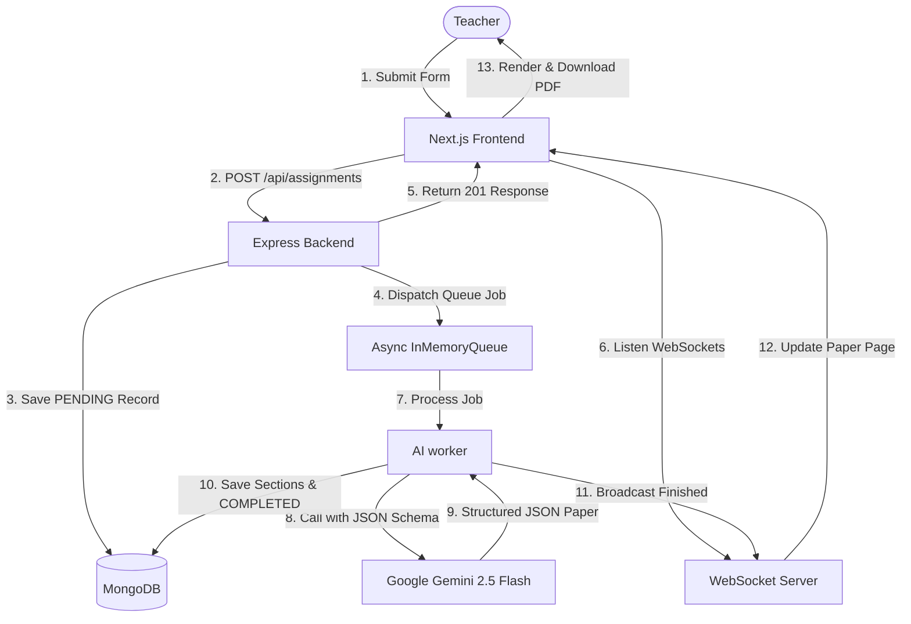

# VedaAI Assessment Creator 🚀

VedaAI is a Full-Stack AI Assessment Creator built for teachers. It replicates the provided Figma design with pixel-perfect accuracy and features a modern, responsive user experience. It leverages the Google Gemini 2.5 Flash API to dynamically generate structured exam papers in the background and stream progress in real-time via WebSockets.

---

## 🏗️ Architecture

Below is the high-level architecture diagram showing the flow of request handling, background processing, and real-time streaming:



---

## ✨ Features

### 1. **Assignment Creation Form**
- **File Upload Support**: Beautiful file dropzone UI.
- **Due Date Selection**: Standard date input.
- **Question Types & Weights**: Interactive stepper control to dynamically set quantity and marks per question type.
- **Form Validation**: Client-side validation ensuring positive values, dates, and non-empty selections.
- **Additional Instructions**: Text area to specify difficulty, exam duration, or curriculum constraints.

### 2. **Real-time Live Queue**
- **Asynchronous Queue**: Implements an in-memory queue that mimics the BullMQ/Redis architecture, allowing the app to run locally without a Redis server.
- **WebSocket Streaming**: Updates the frontend status continuously (PENDING ➔ GENERATING ➔ COMPLETED) as the background job progresses.
- **Regenerate Option**: If the generated paper doesn't fit requirements, click **Regenerate** to dispatch a new job and re-queue generation.

### 3. **Premium Figma-Matched UI**
- **Sidebar Navigation**: Sleek dark sidebar with dashboard and creation tabs.
- **Orange Accents & Glassmorphic touches**: Follows the Figma color scheme, font layout, padding, and UI transitions.
- **Color-Coded Difficulty Badges**: Easy (Green), Medium (Orange), Hard (Red).
- **Responsive Layout**: Designed to look great across tablet and desktop viewports.

### 4. **Teacher Dashboard**
- **Assignment History**: Fetch and display all past assignments directly from MongoDB.
- **Counters**: View metrics such as the total number of assessments generated.
- **Direct Navigation**: Click on any past card to route straight to its generated paper.
- **Delete Functionality**: Click the `X` button on any dashboard row to delete past records.

### 5. **High-Quality PDF Engine**
- **Clean Layouts**: Fits standard printing guidelines.
- **Clean Print Output**: Embedded `@media print` styles and capture hooks ensure that UI buttons, headers, sidebars, and difficulty badges are hidden when printing. The result is a clean, professional school-style assessment paper.

---

## 🛠️ Tech Stack

- **Frontend**: Next.js 15 (App Router), Zustand (State Management), HTML5 Canvas/jsPDF (PDF Engine), Lucide React (Icons).
- **Backend**: Node.js, Express, WebSocket (`ws`), TypeScript, Mongoose.
- **Database**: MongoDB.
- **AI Integration**: Google Gemini 2.5 Flash API (`@google/generative-ai` SDK).

---

## 🚀 Setup & Installation

### 1. Clone the repository
```bash
git clone <your-repository-url>
cd VedAssessment
```

### 2. Configure Environment Variables

#### Backend (`/backend/.env`)
Create a file named `.env` in the `backend` folder:
```env
PORT=5000
MONGODB_URI=mongodb://127.0.0.1:27017/veda-assessment
GEMINI_API_KEY=your_gemini_api_key_here
```

#### Frontend (`/frontend/.env.local`)
Create a file named `.env.local` in the `frontend` folder:
```env
NEXT_PUBLIC_API_URL=http://localhost:5000
NEXT_PUBLIC_WS_URL=ws://localhost:5000
```

### 3. Run Locally

You can run both folders using the root script or run them individually.

#### Option A: Running from the Root (Recommended)
1. Install dependencies for both:
   ```bash
   npm run install:all
   ```
2. Start the Backend server:
   ```bash
   npm run dev:backend
   ```
3. Start the Frontend Next.js server (in a separate terminal):
   ```bash
   npm run dev:frontend
   ```

#### Option B: Running Manually

##### Backend:
```bash
cd backend
npm install
npm run build
npm start
```

##### Frontend:
```bash
cd ../frontend
npm install
npm run dev
```

The frontend will run on [http://localhost:3000](http://localhost:3000) and the backend will run on [http://localhost:5000](http://localhost:5000).

---

## ☁️ Deployment Guide

### Backend (Render or Railway)
1. Push your repository to GitHub.
2. Link the repository to Render/Railway.
3. Set the **Root Directory** to `backend`.
4. Set the **Build Command** to `npm install && npm run build`.
5. Set the **Start Command** to `npm start`.
6. Configure the Environment Variables:
   - `MONGODB_URI`: Point to your MongoDB Atlas connection string.
   - `GEMINI_API_KEY`: Your Gemini API Key.

### Frontend (Vercel)
1. Create a new project in Vercel and link your GitHub repository.
2. Set the **Root Directory** to `frontend`.
3. Set **Framework Preset** to `Next.js`.
4. Configure the Environment Variables:
   - `NEXT_PUBLIC_API_URL`: Set to your deployed backend URL (e.g. `https://your-backend.onrender.com`).
   - `NEXT_PUBLIC_WS_URL`: Set to your deployed WebSocket URL (e.g. `wss://your-backend.onrender.com`).
5. Click Deploy!
